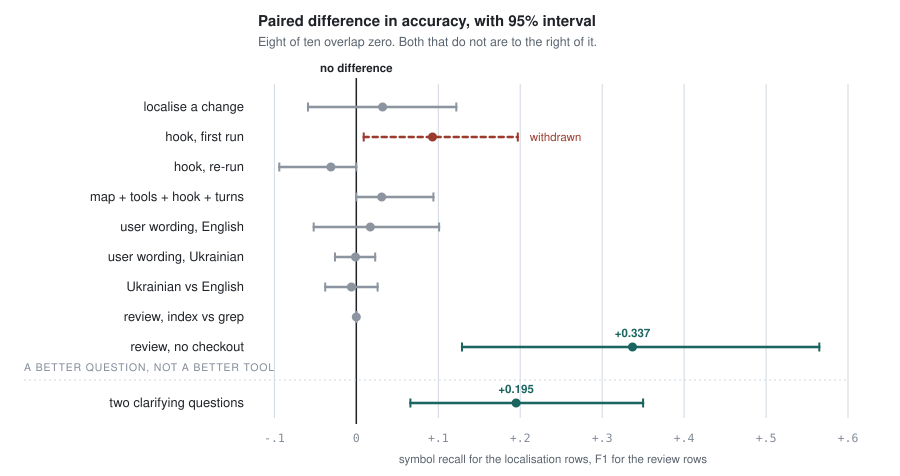

# Twelve Comparisons Against grep

*What happened when an oracle-verified code index for LLM agents was
measured instead of asserted.*

We built a code index for coding agents, checked that its edges were
correct against compiler-backed oracles, and then measured whether it
helped. Eleven times it did not. The twelfth held — in the one setting
where the agent has no files to search.

Then we stopped changing the tools and changed the request instead, and
recovered more accuracy in one run than every tool in the project had
managed put together.

| | |
| --- | --- |
| Head-to-head comparisons | **12** |
| Intervals excluding zero, from tooling | **1** |
| Intervals excluding zero, from asking | **1** |
| Results withdrawn | **1** |
| Definition precision against SCIP | **1.000** |

Code-graph tools for coding agents arrived in force through 2025 and 2026,
several with tens of thousands of stars. They report token savings and
answer quality. Almost none report whether the edges they emit are correct
— which matters more than it sounds, because an index that claims a call
that does not exist is worse than no index: the agent follows it and spends
a turn in the wrong file.

So the measurement was built first and the extractor second. Every claim
below is scored against compiler-backed `scip-php`, `scip-typescript` and
`scip-python` indexes, on three production repositories, with paired
bootstrap intervals and thresholds written down before each run.

## Ten intervals, and where the two that cleared zero are

<picture>
  <source media="(prefers-color-scheme: dark)" srcset="img/intervals-dark.svg">
  
</picture>

Each bar is a 95% paired bootstrap interval and the dot is the point
estimate. Accuracy is symbol recall for the localisation rows and F1 for
the review rows, both bounded 0 to 1. The figure is generated from the
figures by [scripts/interval_plot.py](../scripts/interval_plot.py), so a
bar cannot drift from the number it stands for.

Eight of the ten overlap zero. One of the two that does not is a diff
reviewed with **no working tree**, where the comparison is against an agent
that can only read files — the index substituting for a checkout rather
than beating one.

The other is not a tool at all. It is the same agent, the same grep, the
same tasks, asked the same vague request **plus two clarifying questions**,
and it is the reason the dashed rule is in the picture: everything above it
is a better tool, and the thing that worked was a better question.

## The index itself is not the problem

Before reading a null as evidence about indexes in general, it is worth
establishing that this one works. Scored against real SCIP indexes from
three language toolchains, the extractor places definitions at **1.000**
precision in all three languages. On three production repositories it
scores **1.000** on definitions and **0.990–0.991** F1 on references
against `scip-php`.

It also wins the offline comparison it was built for. Asked who uses a
symbol, on the fourteen symbols a compiler can ground-truth:

| tool | precision | recall | F1 | tokens |
| --- | ---: | ---: | ---: | ---: |
| `find_references` | 1.000 | 1.000 | **1.000** | 170 |
| `rg -w <name>` | 0.782 | 1.000 | 0.847 | 331 |

Better answers for half the tokens. That advantage is real, reproducible,
and — as everything below shows — almost entirely irrelevant to an agent
that also has a shell.

## What the agent actually did

| what was asked | n | result | verdict |
| --- | ---: | --- | --- |
| Localise a change from a commit subject | 24 | +0.032 [−0.059, +0.122] | null |
| Find every call site of a symbol | 14 | both F1 1.000; grep 6.3 turns, index 20.4 | null |
| Ranked map vs unranked outline, same size | 56 | never clears zero, on either repository | null |
| Hook that answers each search, first run | 24 | +0.093 [+0.009, +0.197] | **withdrawn** |
| The same hook, same tasks, re-run | 8 | −0.031 [−0.094, +0.000] | null |
| Map + tools + hook + 40 turns | 8 | +0.031 [+0.000, +0.094] | null |
| Requests in a user's words, English | 16 | +0.017 [−0.052, +0.101] | null |
| Requests in a user's words, Ukrainian | 18 | −0.001 [−0.026, +0.023] | null |
| Review a diff, index vs grep | 36 | 0.000 [0.000, 0.000] | null |
| Review a diff with **no checkout** | 14 | **+0.337 [+0.129, +0.565]**, W6/L0 | **held** |
| The same request plus **two clarifying questions** | 17 | **+0.195 [+0.066, +0.350]**, W8/L0 | **held** |

Where a shell and a checkout exist, `grep` is not merely competitive — it
is cheaper. On the call-site task it took 6.3 turns to the index's 20.4,
for the same perfect score. On localisation the index arm used 19% more
tokens and 3.7 more turns to finish level.

The obvious explanation — the agent ignores the tool — is wrong, and it was
checked. On the localisation run the index arm called the index 8.5 times
per run and not one of twenty-four runs ignored it. It was used. It did not
pay.

## The one that held

Take the checkout away and the picture inverts. Given a diff and no files to
search, an agent that can only read is in trouble: on a 1,832-file
application it failed outright on 5 of 14 questions. With the index it
answered 13.

| arm | F1 | cost |
| --- | ---: | ---: |
| read only, no search | 0.503 | $1.228 |
| **index, no checkout** | **0.839** | **$0.324** |
| grep, with a checkout | 0.868 | $0.337 |

> The index does not beat a checkout. It **substitutes** for one — at the
> same accuracy, the same cost, and a third of the turns. On a smaller
> repository the same comparison against grep is 0.000 with a zero-width
> interval.

## Why there was nothing to find

Eleven nulls is a pattern, not an accident, and the argument that kept the
work alive was this: every task so far had been posed as a *commit subject*
— written by the developer who had just made the change, in the vocabulary
of the code. Half those nouns are identifiers. That is the condition `grep`
is best in, because the request already contains the string to search for.

Real requests do not look like that. *"The button on the report page that
clears it doesn't work"* names nothing in the code. So nineteen requests
were written from each change's diff rather than its subject, and how much
each gave away was checked mechanically: a wording counts as anchored if it
shares any identifier or path segment with the answer, in any casing.

Not one English wording came out unanchored. Writing deliberately in user
language — "square" for cell, "box" for field — still leaves an overlap,
because the code is English and so is the user. The same nineteen in
Ukrainian share **nothing** with their answers, because the codebase
contains no Ukrainian. That is the sharpest condition available: a text
search with no string to search for.

| grep alone | English | Ukrainian | paired difference |
| --- | ---: | ---: | --- |
| symbol recall | 0.287 | 0.281 | −0.006 [−0.038, +0.026] |
| file recall | 0.745 | 0.779 | +0.034 [−0.020, +0.108] |
| turns | 24.6 | 22.7 | −2.0 [−5.5, +1.5] |

> Removing every shared word between the request and the code cost the
> baseline six thousandths of a point — and it used fewer turns.

An agent does not search for the words in the request. It reads the
request, forms a hypothesis in the codebase's own vocabulary, and searches
for *that*. The model supplies the anchor itself, so the anchor was never
missing. "The request has no string to grep for" describes a problem the
agent does not have.

That was the last standing theoretical case for a resolved index helping an
agent that already has a shell. The index changed nothing there either:
**−0.001 [−0.026, +0.023]** over eighteen tasks. The interval is ±0.025
wide, so this is a tight null rather than an underpowered one.

## The result we withdrew

One comparison did clear the bar, and reporting what happened to it is the
point of pre-registering anything.

Instead of offering the index as a tool the agent could call, it was made to
answer: a `PostToolUse` hook that runs after each search and appends which
definition each hit belongs to. First measurement: symbol recall 0.464 to
0.556, paired **+0.093 [+0.009, +0.197]**, six wins to none. The interval
excluded zero. The shape was right too — file recall was unchanged and
already near its ceiling, so all the movement was in *which symbol* was
named, which is the only thing the hook says.

A second run of the same tasks scored it at **−0.031**. Four tasks that had
gained 0.33, 0.25, 0.25 and 0.14 came back at exactly zero; one reversed.

> The line that settles it is not the delta. `grep` returned an identical
> score on seven of the eight shared tasks — so the harness, the tasks and
> the scoring are near-deterministic, and what moved was the arm under test.

Seventeen of the original twenty-four tasks had been exact ties, so the
whole result rested on seven. That was written down as a caveat before the
re-run, and it was the right caveat.

The explanation was wrong too. The first guess was that injected context is
a branch point and therefore variance — but across the two wording runs the
hook arm was the *steadier* of the two (identical on 13 of 16 and 12 of 18
repeats, mean swing 0.046 against 0.085). A post-hoc explanation that fails
its next two tests is worth retracting loudly.

## The largest effect measured here is not about indexes

One number dwarfs everything else, and no tool in this project touches it.
Same repository, same commits, same arms — only the sentence changed.

| grep alone | commit subject | user wording |
| --- | ---: | ---: |
| symbol recall | 0.464 | **0.274** |
| file recall | 0.958 | **0.737** |
| turns | 17.3 | 24.1 |
| tokens | 399,269 | 745,227 |
| runs lost to the turn cap | 0 | **8** |

Asking in a person's words instead of a developer's halves accuracy and
roughly doubles cost. Both arms fall together, so the index does nothing
about it — but it does mean every earlier comparison in this field,
including the first nine here, was run on the easy half of the
distribution.

If you want a coding agent to be cheaper today, the lever with the largest
measured effect is not retrieval. It is writing the request in the
vocabulary of the code.

## If you are building one of these

- **Score your edges against a compiler** before reporting anything about
  tokens. A wrong edge costs a turn; an absent one costs nothing.
- **Register the threshold before the run.** Ours caught our own false
  positive, which no amount of care afterwards would have.
- **Run it twice.** A single paired run on a task set with many ties is a
  hypothesis, not a finding.
- **Report win–loss counts beside the interval.** Pooling the two wording
  runs gives a token saving whose interval excludes zero — with sixteen
  tasks cheaper and eighteen dearer. The interval is misleading; the counts
  are the warning.
- **Test the no-shell case separately.** It is a different product, and it
  is where the only surviving win lives.

## Limits

**Every repository measured here is a private client application.** They
are identified by stack and size rather than by name, because their
identity is not ours to publish and no figure needs it — but it means the
runs cannot be repeated against the same code. The harness, the oracles and
every run's parameters are public; the code they were pointed at is not.

The agent-level work is one model — Opus 5 — on a Laravel and Vue stack,
across two applications of 363 and 1,832 indexed files. The no-checkout
result covers three repositories, all PHP, fourteen questions each; it has
not been confirmed in another language. Two runs were cut short by a spend
limit, at 9 tasks of 24 and at the final run of a batch. Symbol recall
against what a commit changed is a proxy for a change an agent has not been
asked to make, and the ceiling of that task is certainly well below 1.000 —
though when the agent found every changed file it named at least one correct
symbol in 93% of runs, so the gap between file recall and symbol recall is
real rather than an artefact of the metric.

None of that rescues the central claim. Eleven nulls, one withdrawal, and a
directly falsified mechanism are not the shape of an effect waiting for more
power.

---

Measured September 2026 with Claude Opus 5 under a Max plan. The harness,
the oracles and every figure above are in this repository; the underlying
reports are in [docs/benchmarks/](benchmarks/). Raw runs are kept out of the
repository because they carry a client application's commit subjects and
paths — the aggregates here are everything those reports quote.
